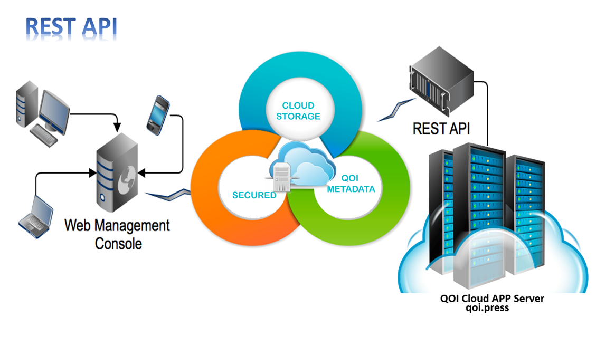

# Дипломная работа к профессии Python-разработчик «API Сервис заказа товаров для розничных сетей».



## Инструкция по установке

Для запуска проекта необходимо:
- скачать репозиторий
- установить зависимости `pip install -r requirements.txt`
- установить Redis (https://redis.io/topics/quickstart)
- для Windows доступна альтернативная установка https://riptutorial.com/ru/redis/example/29962/установка-и-запуск-redis-server-в-windows
- запустить Redis командой `redis-server.exe`
- запустить Celery командой `celery --app shopAPI --concurrency=4`
- запустить проект командой `python manage.py runserver`

Для корректной работы email-уведомлений необходимо создать файл private_email.py в папке shop_API указав настройки вашего почтового сервиса.
```
EMAIL_USE_TLS = True
EMAIL_HOST = 'smtp.gmail.com'
EMAIL_PORT = 587
EMAIL_HOST_USER = 'Почта хоста на домене @gmail.com'
EMAIL_HOST_PASSWORD = 'Пароль от почты'
DEFAULT_FROM_EMAIL = 'Интернет-магазин электроники Тындекс-Рест!'
DEFAULT_TO_EMAIL = 'Почта хоста на домене @gmail.com'
```
Для учетной записи google, необходимо разрешить для почты небезопасные приложения: Allow less secure apps: ON

## Учетные данные и документация

Данные суперпользователя:
- admin@admin.netology
- admin

Документация по запросам Postman (сделана вручную):
- https://documenter.getpostman.com/view/12616380/TVKBZdrj
 
Документация по запросам Postman (автоматически сгенерированная):
- https://documenter.getpostman.com/view/12616380/TVYDdeUX

## Описание

Приложение предназначено для автоматизации закупок в розничной сети. Пользователи сервиса — покупатель (менеджер торговой сети, который закупает товары для продажи в магазине) и поставщик товаров.

**Клиент (покупатель):**

- Менеджер закупок через API делает ежедневные закупки по каталогу, в котором
  представлены товары от нескольких поставщиков.
- В одном заказе можно указать товары от разных поставщиков — это
  повлияет на стоимость доставки.
- Пользователь может авторизироваться, регистрироваться и восстанавливать пароль через API.
    
**Поставщик:**

- Через API информирует сервис об обновлении прайса.
- Может включать и отключать прием заказов.
- Может получать список оформленных заказов (с товарами из его прайса).

